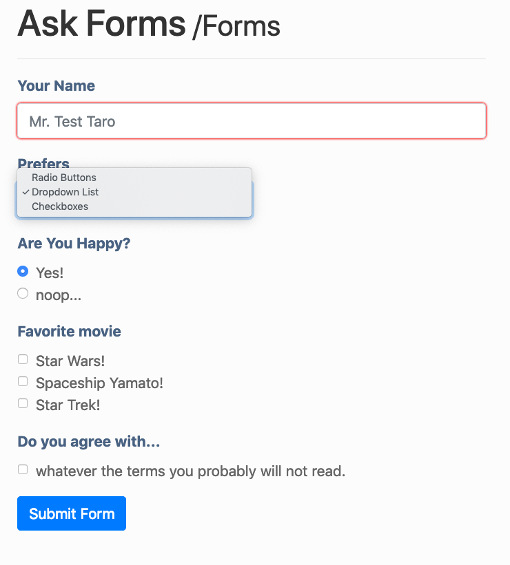

ask_questions
=============

a simple questionnaire builder for html form and validator.  

Overview
--------

### Installation

```sh
composer require wscore/ask
```

### Demo

To view a demo, open a terminal and...

```sh
$ git clone https://github.com/WScore/AskQuestions
$ cd AskQuestions
$ composer install
$ cd demo
$ php -S localhost:8000
```

...and view `localhost:8000` with a browser.

Sample Code
-----------

To use `WScore\Ask` component, define `AskModel`, first. 

### Define Questions

```php
function buildAskForms() {
    $ask = new \WScore\Ask\AskModel();

    $ask->addText('name', 'Your Name')
        ->setPlaceholder('Mr. Test Taro');
}
```

### HTML forms

to show an form in an html file, 

```php
$ask = buildAskForms();
$forms = $ask->buildForm();
```

if you are using Bootstrap 4, it may be useful to 
set a default class for input and label class.  

```php
$forms->setFormClass('form-control');
$forms->setLabelClass('form-label');
```

then, output HTML form in an HTML form, as

```php
<form action="..." method="post">
    <?php $element = $forms->getElement('name'); ?>
    <?= $element->makeLabel(); ?>
    <?= $element->makeForm(); ?>
```



### Validating Input

to validate input, 

```php
$ask = buildAskForms();
$validator = $ask->buildValidator($_POST);
$results = $validator->getResults();

// show some message.
if ($validator->isValid()) {
    echo "<div class='alert alert-success'>Success!!!</div>";
} else {
    echo "<div class='alert alert-danger'>Error ???</div>";
}
```

then, obtain result for each value as,

```php
<table class="table">
    <?php $result = $validator->getResult('name') ?>
    <tr>
        <th><?= $result->label(); ?></th>
        <td><?= $result->showValue('<br>'); ?></td>
        <?php
            if (!$result->isValid()) {
                echo "<p class='error text-danger' >{$result->getMessage()}</p>";
            }
        ?></td>
    </tr>
    <?php endforeach; ?>
</table>
```

Advanced
--------

### More Validation

Default validation only has required checks. 

Use closure to create a fine validation method;

```php
$ask->setValidator(function (Validation $validation) {
    $name = $valication->getResult('name');
    if (strlen($name) < 3) {
        $validation->setError('name', $name, 'must be longer than 2 characters.');
    }
});

``` 

TODO
====

- internationalize error message. 